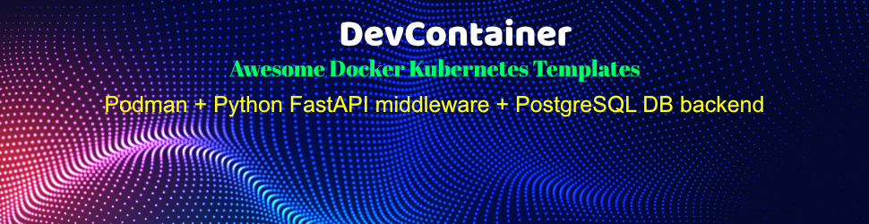
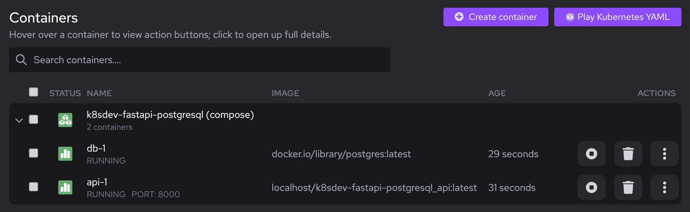
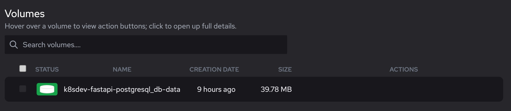

## Compose sample application that contains:

- Python FastAPI (for middleware)
- PostgreSQL DB (for backend)

### Use with Docker Development Environments

You can open this sample in the Dev Environments feature of Docker Desktop version 4.12 or later.

[Open in Docker Dev Environments ](https://open.docker.com/dashboard/dev-envs?url=https://github.com/docker/awesome-compose/tree/master/fastapi)

### Python/FastAPI application

Project structure:

```
├── compose.yaml
├── Dockerfile
├── requirements.txt
├── app
    ├── main.py
    ├── __init__.py

```

[_compose.yaml_](compose.yaml)

```
services:
  api:
    build: .
    container_name: fastapi-application
    environment:
      PORT: 8000
    ports:
      - '8000:8000'
    restart: "no"

```

## Deploy with docker compose

```shell
docker-compose up -d --build
```

## Expected result

Listing containers must show one container running and the port mapping as below:

```
$ docker ps
CONTAINER ID   IMAGE          COMMAND       CREATED              STATUS              PORTS                                               NAMES
7087a6e79610   5c1778a60cf8   "/start.sh"   About a minute ago   Up About a minute   80/tcp, 0.0.0.0:8000->8000/tcp, :::8000->8000/tcp   fastapi-application
```

After the application starts, navigate to `http://localhost:8000` in your web browser and you should see the following json response:

```
{
"message": "OK"
}
```

Stop and remove the containers

```
$ docker compose down
```

### Use with Podman/Podman Desktop Development Environments

## Prerequisites

- podman
- podman-compose
- podman desktop

```
podman-compose -f compose.yaml up -d
```

# Sample View in Podman Desktop




# To reinitialize the Postgres Volume

```
# Stop and delete the containers, then:

podman volume list | grep "db-data"
podman volume rm ${volume-name}
-or-
podman volume rm  $(podman volume list | grep "db-data" | cut -d " "  -f2-)
```

# To connect via psql

```
# psql [OPTION]... [DBNAME [USERNAME]]

# To connect to main DB
podman exec -it $(podman container list | grep "docker.io/library/postgres" | cut -d " " -f1) psql postgres postgres;

# To connect to appdb (bookstore schema is under appdb)
podman exec -it $(podman container list | grep "docker.io/library/postgres" | cut -d " " -f1) psql appdb appusr;

# After the psql prompt:
appdb=> \dt bookstore.*;
          List of relations
  Schema   | Name | Type  |  Owner
-----------+------+-------+----------
 bookstore | book | table | postgres
(1 row)
appdb=> SELECT * FROM bookstore.book LIMIT 10;
... removed intentionally
(10 rows)
```
